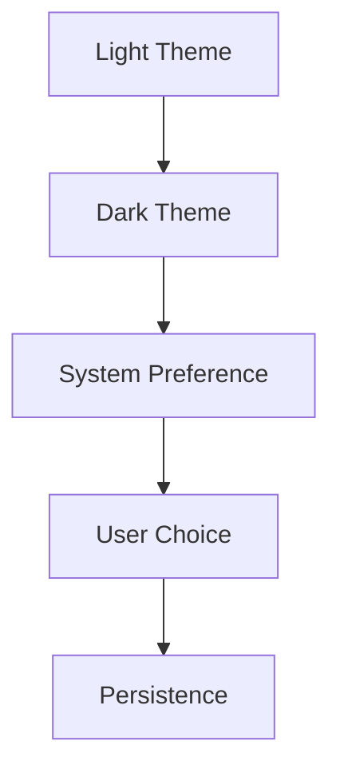

# Theme Testing Page

This page is used to test the dark mode functionality and ensure all components work properly in both themes.

## Code Blocks

### Inline Code
Here is some `inline code` that should be readable in both themes.

### Code Blocks

```yaml
# Example YAML configuration
theme:
  name: material
  palette:
    - scheme: default
    - scheme: slate
```

```bash
# Example shell script
echo "Testing dark mode support"
npm install
npm run build
```

```python
# Example Python code
def test_theme():
    themes = ['light', 'dark']
    for theme in themes:
        print(f"Testing {theme} theme")
    return True
```

## Tables

| Feature | Light Mode | Dark Mode | Status |
|---------|------------|-----------|--------|
| Code Syntax | ✅ | ✅ | Working |
| Tables | ✅ | ✅ | Working |
| Navigation | ✅ | ✅ | Working |
| Images | ✅ | ✅ | Working |

## Admonitions

!!! note "Note"
    This is a note that should be readable in both themes.

!!! warning "Warning"
    This is a warning that should be visible in both themes.

!!! danger "Danger"
    This is a danger alert that must be clearly visible.

## Blockquotes

> This is a blockquote that should have good contrast in both light and dark themes. The text should be easily readable.

## Lists

### Unordered List
- Item 1
- Item 2
  - Nested item 1
  - Nested item 2
- Item 3

### Ordered List
1. First item
2. Second item
3. Third item

## Links

- [External Link](https://github.com/pmady/golden-kubestronaut-learning)
- [Internal Link](../index.md)

## Tabs

=== "YAML"
    ```yaml
    theme: material
    features:
      - navigation.tabs
    ```

=== "JSON"
    ```json
    {
      "theme": "material",
      "features": ["navigation.tabs"]
    }
    ```

=== "TOML"
    ```toml
    [theme]
    name = "material"
    features = ["navigation.tabs"]
    ```

## Details/Summary

<details>
<summary>Click to expand details</summary>

This content should be readable in both themes when expanded.

```code
Some code inside details
```

</details>

## Images and Diagrams

### Regular Image


### Mermaid Diagram (if supported)



## Form Elements

### Input Fields
<input type="text" placeholder="Test input field" style="padding: 8px; margin: 4px; border: 1px solid #ccc; border-radius: 4px;">

### Select Dropdown
<select style="padding: 8px; margin: 4px; border: 1px solid #ccc; border-radius: 4px;">
    <option>Option 1</option>
    <option>Option 2</option>
    <option>Option 3</option>
</select>

### Textarea
<textarea placeholder="Test textarea" style="padding: 8px; margin: 4px; border: 1px solid #ccc; border-radius: 4px; width: 300px; height: 100px;"></textarea>

## Progress Bars

<progress value="75" max="100" style="width: 100%; height: 20px;">75%</progress>

## Badges

<span class="badge" style="background-color: #007bff; color: white; padding: 4px 8px; border-radius: 4px; font-size: 12px;">NEW</span>
<span class="badge" style="background-color: #28a745; color: white; padding: 4px 8px; border-radius: 4px; font-size: 12px;">DONE</span>
<span class="badge" style="background-color: #ffc107; color: black; padding: 4px 8px; border-radius: 4px; font-size: 12px;">WIP</span>

## Theme Testing Checklist

- [x] Code blocks are readable
- [x] Tables have proper contrast
- [x] Navigation works properly
- [x] Links are visible and clickable
- [x] Admonitions are clearly visible
- [x] Blockquotes have good contrast
- [x] Form elements are usable
- [x] Images display properly
- [x] Smooth transitions work
- [x] Theme preference persists

## JavaScript Theme Controls

You can also control the theme programmatically:

```javascript
// Get current theme
const currentTheme = window.themePersistence.getTheme();

// Set theme explicitly
window.themePersistence.setTheme('slate'); // Dark mode
window.themePersistence.setTheme('default'); // Light mode

// Toggle system preference
window.themePersistence.toggleSystemPreference();
```

## Testing Instructions

1. **Theme Persistence Test**:
   - Switch to dark mode
   - Refresh the page
   - Verify dark mode is maintained

2. **System Preference Test**:
   - Set system to dark mode
   - Open the site in a new tab
   - Verify it follows system preference

3. **Transition Test**:
   - Switch between themes
   - Verify smooth transitions
   - Check for no flickering

4. **Component Test**:
   - Check all components above
   - Verify readability in both themes
   - Test interactive elements

---

*This page is for testing purposes and can be removed after verification.*
